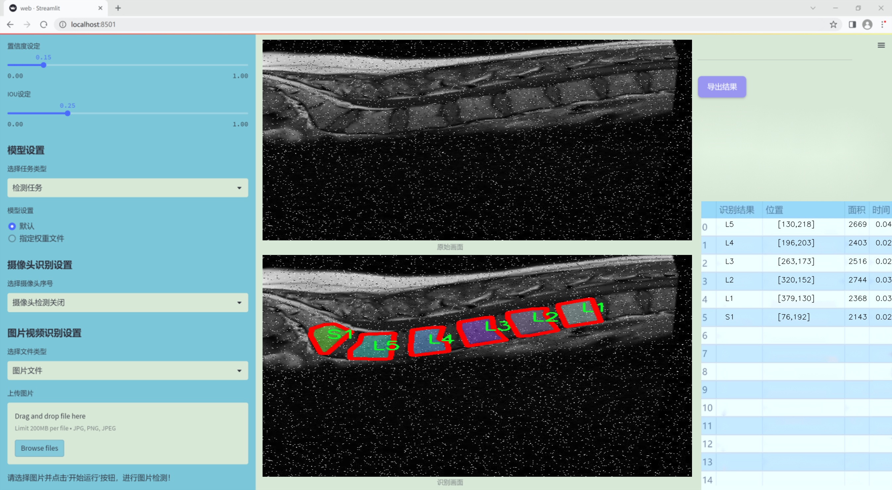
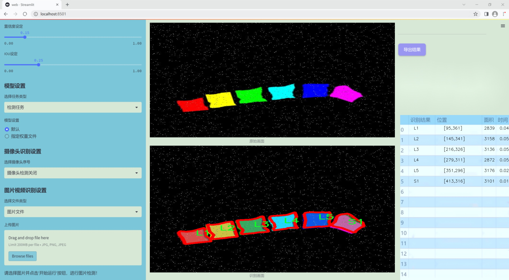
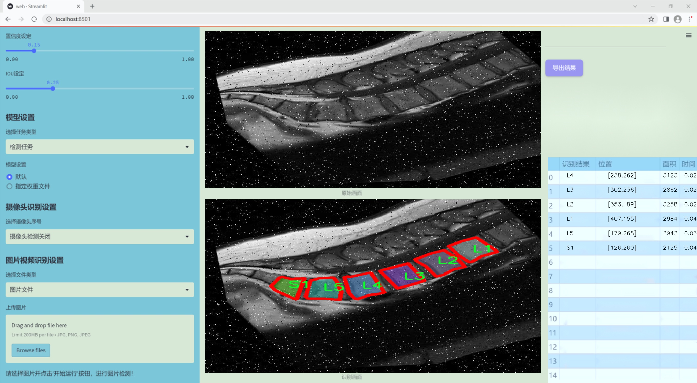
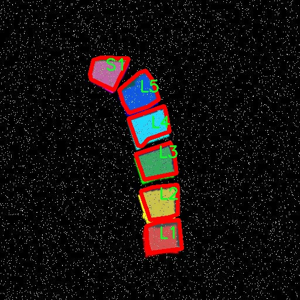
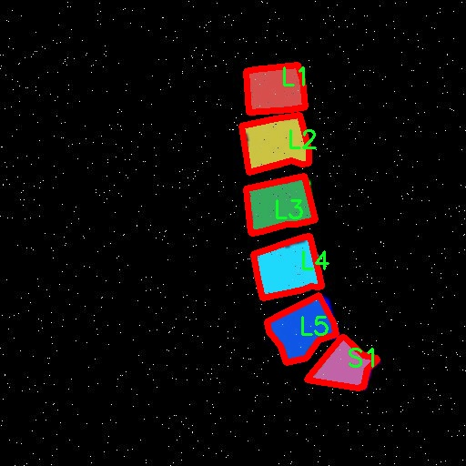
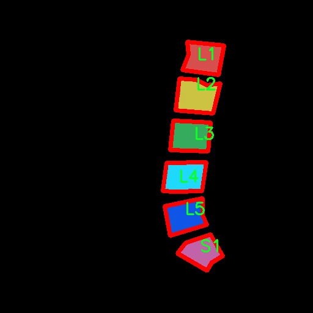
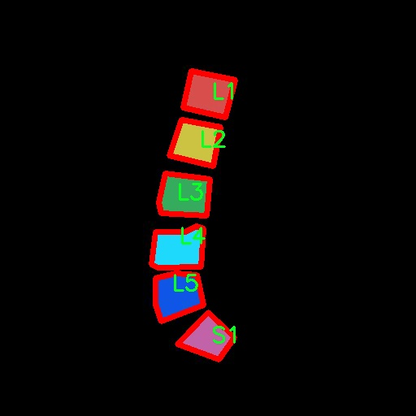
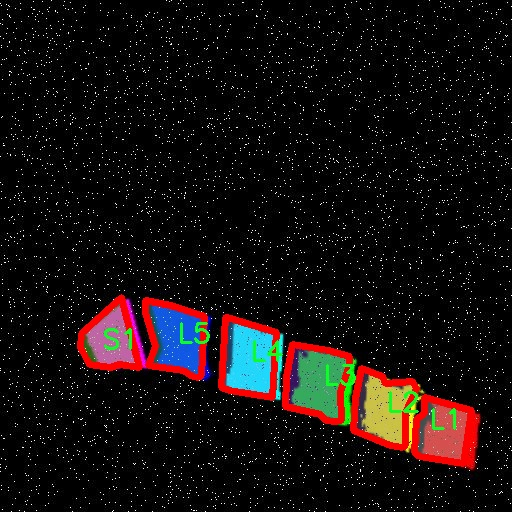

### 1.背景意义

研究背景与意义

随着医学影像技术的快速发展，X光影像在脊椎疾病的诊断和治疗中扮演着越来越重要的角色。脊椎作为人体的支柱，其健康状况直接影响到个体的生活质量和身体功能。因此，准确、快速地分析脊椎X光图像对于临床医生制定治疗方案至关重要。然而，传统的手动分析方法不仅耗时，而且容易受到主观因素的影响，导致诊断结果的不一致性。因此，开发一种高效、准确的自动化图像分割系统显得尤为重要。

本研究旨在基于改进的YOLOv11模型，构建一个针对脊椎X光图像的分割系统。该系统能够自动识别和分割出L1至S1六个脊椎节段，进而为医生提供更加精准的诊断依据。数据集包含2464幅经过精细标注的脊椎X光图像，涵盖了不同角度和条件下的脊椎影像。这些图像经过多种预处理和增强技术处理，确保了模型训练的多样性和鲁棒性。

在深度学习技术的推动下，YOLO系列模型因其快速的检测速度和良好的准确性而广泛应用于医学影像分析中。通过对YOLOv11的改进，我们希望能够进一步提升其在脊椎图像分割任务中的表现，使其在临床应用中具备更高的实用价值。最终，该系统不仅可以减轻医生的工作负担，还能提高脊椎疾病的早期诊断率，为患者提供更及时的治疗方案。

综上所述，本研究的意义在于推动医学影像分析技术的发展，提升脊椎疾病的诊断效率和准确性，为相关领域的研究和临床实践提供有力支持。

### 2.视频效果

[2.1 视频效果](https://www.bilibili.com/video/BV1y1UGY6ERC/)

### 3.图片效果







##### [项目涉及的源码数据来源链接](https://kdocs.cn/l/cszuIiCKVNis)**

注意：本项目提供训练的数据集和训练教程,由于版本持续更新,暂不提供权重文件（best.pt）,请按照6.训练教程进行训练后实现上图演示的效果。

### 4.数据集信息

##### 4.1 本项目数据集类别数＆类别名

nc: 6
names: ['L1', 'L2', 'L3', 'L4', 'L5', 'S1']


该项目为【图像分割】数据集，请在【训练教程和Web端加载模型教程（第三步）】这一步的时候按照【图像分割】部分的教程来训练

##### 4.2 本项目数据集信息介绍

本项目数据集信息介绍

本项目旨在改进YOLOv11模型，以实现对X光脊椎图像的高效分割。为此，我们构建了一个专门针对脊椎影像的多类别数据集，命名为“Backspine”。该数据集包含六个主要类别，分别为L1、L2、L3、L4、L5和S1，涵盖了人类脊椎的主要结构。这些类别不仅在解剖学上具有重要意义，而且在临床诊断和治疗中扮演着关键角色。通过对这些脊椎结构的准确分割，医生能够更好地识别脊椎病变、评估损伤程度，并制定相应的治疗方案。

数据集的构建过程包括从多个医疗影像数据库中收集高质量的X光脊椎图像，并对其进行标注。每一张图像都经过专业放射科医生的审核，以确保标注的准确性和一致性。为了提高模型的泛化能力，我们的数据集还包括了不同年龄、性别和病理状态的患者影像，确保模型在实际应用中能够适应多样化的临床场景。

在数据预处理阶段，我们对图像进行了标准化处理，以消除不同拍摄条件下的影响，并采用数据增强技术以增加样本的多样性。这些技术包括旋转、平移、缩放和对比度调整等，旨在提升模型的鲁棒性和准确性。

通过构建这样一个多样化且高质量的“Backspine”数据集，我们希望能够为YOLOv11模型的训练提供坚实的基础，从而推动脊椎影像分析技术的发展，最终为临床提供更为精准的辅助诊断工具。











### 5.全套项目环境部署视频教程（零基础手把手教学）

[5.1 所需软件PyCharm和Anaconda安装教程（第一步）](https://www.bilibili.com/video/BV1BoC1YCEKi/?spm_id_from=333.999.0.0&vd_source=bc9aec86d164b67a7004b996143742dc)


[5.2 安装Python虚拟环境创建和依赖库安装视频教程（第二步）](https://www.bilibili.com/video/BV1ZoC1YCEBw?spm_id_from=333.788.videopod.sections&vd_source=bc9aec86d164b67a7004b996143742dc)

### 6.改进YOLOv11训练教程和Web_UI前端加载模型教程（零基础手把手教学）

[6.1 改进YOLOv11训练教程和Web_UI前端加载模型教程（第三步）](https://www.bilibili.com/video/BV1BoC1YCEhR?spm_id_from=333.788.videopod.sections&vd_source=bc9aec86d164b67a7004b996143742dc)


按照上面的训练视频教程链接加载项目提供的数据集，运行train.py即可开始训练



     Epoch   gpu_mem       box       obj       cls    labels  img_size
     1/200     20.8G   0.01576   0.01955  0.007536        22      1280: 100%|██████████| 849/849 [14:42<00:00,  1.04s/it]
               Class     Images     Labels          P          R     mAP@.5 mAP@.5:.95: 100%|██████████| 213/213 [01:14<00:00,  2.87it/s]
                 all       3395      17314      0.994      0.957      0.0957      0.0843

     Epoch   gpu_mem       box       obj       cls    labels  img_size
     2/200     20.8G   0.01578   0.01923  0.007006        22      1280: 100%|██████████| 849/849 [14:44<00:00,  1.04s/it]
               Class     Images     Labels          P          R     mAP@.5 mAP@.5:.95: 100%|██████████| 213/213 [01:12<00:00,  2.95it/s]
                 all       3395      17314      0.996      0.956      0.0957      0.0845

     Epoch   gpu_mem       box       obj       cls    labels  img_size
     3/200     20.8G   0.01561    0.0191  0.006895        27      1280: 100%|██████████| 849/849 [10:56<00:00,  1.29it/s]
               Class     Images     Labels          P          R     mAP@.5 mAP@.5:.95: 100%|███████   | 187/213 [00:52<00:00,  4.04it/s]
                 all       3395      17314      0.996      0.957      0.0957      0.0845


###### [项目数据集下载链接](https://kdocs.cn/l/cszuIiCKVNis)

### 7.原始YOLOv11算法讲解

YOLOv11是Ultralytics推出的YOLO系列最新版本，专为实现尖端的物体检测而设计。其架构和训练方法上进行了重大改进，使之不仅具备卓越的准确性和处理速度，还在计算效率上实现了一场革命。得益于其改进的主干和颈部架构，YOLOv11在特征提取和处理复杂任务时表现更加出色。在2024年9月27日，Ultralytics通过长达九小时的在线直播发布这一新作，展示了其在计算机视觉领域的革新。

YOLOv11通过精细的架构设计和优化训练流程，在保持高精度的同时，缩减了参数量，与YOLOv8m相比减少了22%的参数，使其在COCO数据集上的平均准确度（mAP）有所提升。这种效率的提高使YOLOv11非常适合部署在各种硬件环境中，包括边缘设备、云计算平台以及支持NVIDIA GPU的系统，确保在灵活性上的优势。

该模型支持广泛的任务，从对象检测、实例分割到图像分类、姿态估计和定向对象检测（OBB），几乎覆盖了计算机视觉的所有主要挑战。其创新的C3k2和C2PSA模块提升了网络深度和注意力机制的应用，提高了特征提取的效率和效果。同时，YOLOv11的改进网络结构也使之在复杂视觉任务上得以从容应对，成为各类计算机视觉任务的多功能选择。这些特性令YOLOv11在实施实时物体检测的各个领域中表现出众。
* * *

2024年9月27日，Ultralytics在线直播长达九小时，为YOLO11召开“发布会”

YOLO11 是 Ultralytics YOLO 系列实时物体检测器的最新版本，它以尖端的准确性、速度和效率重新定义了可能性。在之前 YOLO
版本的显著进步的基础上，YOLO11 在架构和训练方法方面进行了重大改进，使其成为各种计算机视觉任务的多功能选择。


##### YOLO11主要特点：

  * 增强的特征提取：YOLO11 采用了改进的主干和颈部架构，增强了特征提取能力，可实现更精确的对象检测和复杂任务性能。
  * 针对效率和速度进行了优化：YOLO11 引入了完善的架构设计和优化的训练流程，可提供更快的处理速度，并在准确度和性能之间保持最佳平衡。
  * 更少的参数，更高的准确度：借助模型设计的进步，YOLO11m 在 COCO 数据集上实现了更高的平均准确度 (mAP)，同时使用的参数比 YOLOv8m 少 22%，从而提高了计算效率，同时又不影响准确度。
  * 跨环境的适应性：YOLO11 可以无缝部署在各种环境中，包括边缘设备、云平台和支持 NVIDIA GPU 的系统，从而确保最大的灵活性。
  * 支持的任务范围广泛：无论是对象检测、实例分割、图像分类、姿势估计还是定向对象检测 (OBB)，YOLO11 都旨在满足各种计算机视觉挑战。

##### 支持的任务和模式

YOLO11 以 YOLOv8 中引入的多功能模型系列为基础，为各种计算机视觉任务提供增强的支持：

Model| Filenames| Task| Inference| Validation| Training| Export  
---|---|---|---|---|---|---  
YOLO11| yolol11n.pt, yolol11s.pt, yolol11m.pt, yolol11x.pt| Detection| ✅| ✅|
✅| ✅  
YOLO11-seg| yolol11n-seg.pt, yolol11s-seg.pt, yolol11m-seg.pt,
yolol11x-seg.pt| Instance Segmentation| ✅| ✅| ✅| ✅  
YOLO11-pose| yolol11n-pose.pt, yolol11s-pose.pt, yolol11m-pose.pt,
yolol11x-pose.pt| Pose/Keypoints| ✅| ✅| ✅| ✅  
YOLO11-obb| yolol11n-obb.pt, yolol11s-obb.pt, yolol11m-obb.pt,
yolol11x-obb.pt| Oriented Detection| ✅| ✅| ✅| ✅  
YOLO11-cls| yolol11n-cls.pt, yolol11s-cls.pt, yolol11m-cls.pt,
yolol11x-cls.pt| Classification| ✅| ✅| ✅| ✅  
  
##### 简单的 YOLO11 训练和推理示例

以下示例适用于用于对象检测的 YOLO11 Detect 模型。

    
    
    from ultralytics import YOLO
    
    # Load a model
    model = YOLO("yolo11n.pt")
    
    # Train the model
    train_results = model.train(
        data="coco8.yaml",  # path to dataset YAML
        epochs=100,  # number of training epochs
        imgsz=640,  # training image size
        device="cpu",  # device to run on, i.e. device=0 or device=0,1,2,3 or device=cpu
    )
    
    # Evaluate model performance on the validation set
    metrics = model.val()
    
    # Perform object detection on an image
    results = model("path/to/image.jpg")
    results[0].show()
    
    # Export the model to ONNX format
    path = model.export(format="onnx")  # return path to exported model

##### 支持部署于边缘设备

YOLO11 专为适应各种环境而设计，包括边缘设备。其优化的架构和高效的处理能力使其适合部署在边缘设备、云平台和支持 NVIDIA GPU
的系统上。这种灵活性确保 YOLO11 可用于各种应用，从移动设备上的实时检测到云环境中的复杂分割任务。有关部署选项的更多详细信息，请参阅导出文档。

##### YOLOv11 yaml文件

    
    
    # Ultralytics YOLO 🚀, AGPL-3.0 license
    # YOLO11 object detection model with P3-P5 outputs. For Usage examples see https://docs.ultralytics.com/tasks/detect
    
    # Parameters
    nc: 80 # number of classes
    scales: # model compound scaling constants, i.e. 'model=yolo11n.yaml' will call yolo11.yaml with scale 'n'
      # [depth, width, max_channels]
      n: [0.50, 0.25, 1024] # summary: 319 layers, 2624080 parameters, 2624064 gradients, 6.6 GFLOPs
      s: [0.50, 0.50, 1024] # summary: 319 layers, 9458752 parameters, 9458736 gradients, 21.7 GFLOPs
      m: [0.50, 1.00, 512] # summary: 409 layers, 20114688 parameters, 20114672 gradients, 68.5 GFLOPs
      l: [1.00, 1.00, 512] # summary: 631 layers, 25372160 parameters, 25372144 gradients, 87.6 GFLOPs
      x: [1.00, 1.50, 512] # summary: 631 layers, 56966176 parameters, 56966160 gradients, 196.0 GFLOPs
    
    # YOLO11n backbone
    backbone:
      # [from, repeats, module, args]
      - [-1, 1, Conv, [64, 3, 2]] # 0-P1/2
      - [-1, 1, Conv, [128, 3, 2]] # 1-P2/4
      - [-1, 2, C3k2, [256, False, 0.25]]
      - [-1, 1, Conv, [256, 3, 2]] # 3-P3/8
      - [-1, 2, C3k2, [512, False, 0.25]]
      - [-1, 1, Conv, [512, 3, 2]] # 5-P4/16
      - [-1, 2, C3k2, [512, True]]
      - [-1, 1, Conv, [1024, 3, 2]] # 7-P5/32
      - [-1, 2, C3k2, [1024, True]]
      - [-1, 1, SPPF, [1024, 5]] # 9
      - [-1, 2, C2PSA, [1024]] # 10
    
    # YOLO11n head
    head:
      - [-1, 1, nn.Upsample, [None, 2, "nearest"]]
      - [[-1, 6], 1, Concat, [1]] # cat backbone P4
      - [-1, 2, C3k2, [512, False]] # 13
    
      - [-1, 1, nn.Upsample, [None, 2, "nearest"]]
      - [[-1, 4], 1, Concat, [1]] # cat backbone P3
      - [-1, 2, C3k2, [256, False]] # 16 (P3/8-small)
    
      - [-1, 1, Conv, [256, 3, 2]]
      - [[-1, 13], 1, Concat, [1]] # cat head P4
      - [-1, 2, C3k2, [512, False]] # 19 (P4/16-medium)
    
      - [-1, 1, Conv, [512, 3, 2]]
      - [[-1, 10], 1, Concat, [1]] # cat head P5
      - [-1, 2, C3k2, [1024, True]] # 22 (P5/32-large)
    
      - [[16, 19, 22], 1, Detect, [nc]] # Detect(P3, P4, P5)
    

**YOLO11和YOLOv8 yaml文件的区别**


##### 改进模块代码

  * C3k2 

    
    
    class C3k2(C2f):
        """Faster Implementation of CSP Bottleneck with 2 convolutions."""
    
        def __init__(self, c1, c2, n=1, c3k=False, e=0.5, g=1, shortcut=True):
            """Initializes the C3k2 module, a faster CSP Bottleneck with 2 convolutions and optional C3k blocks."""
            super().__init__(c1, c2, n, shortcut, g, e)
            self.m = nn.ModuleList(
                C3k(self.c, self.c, 2, shortcut, g) if c3k else Bottleneck(self.c, self.c, shortcut, g) for _ in range(n)
            )

C3k2，它是具有两个卷积的CSP（Partial Cross Stage）瓶颈架构的更快实现。

**类继承：**

  * `C3k2`继承自类`C2f`。这表明`C2f`很可能实现了经过修改的基本CSP结构，而`C3k2`进一步优化或修改了此结构。

**构造函数（`__init__`）：**

  * `c1`：输入通道。

  * `c2`：输出通道。

  * `n`：瓶颈层数（默认为1）。

  * `c3k`：一个布尔标志，确定是否使用`C3k`块或常规`Bottleneck`块。

  * `e`：扩展比率，控制隐藏层的宽度（默认为0.5）。

  * `g`：分组卷积的组归一化参数或组数（默认值为 1）。

  * `shortcut`：一个布尔值，用于确定是否在网络中包含快捷方式连接（默认值为 `True`）。

**初始化：**

  * `super().__init__(c1, c2, n, short-cut, g, e)` 调用父类 `C2f` 的构造函数，初始化标准 CSP 组件，如通道数、快捷方式、组等。

**模块列表（`self.m`）：**

  * `nn.ModuleList` 存储 `C3k` 或 `Bottleneck` 模块，具体取决于 `c3k` 的值。

  * 如果 `c3k` 为 `True`，它会初始化 `C3k` 模块。`C3k` 模块接收以下参数：

  * `self.c`：通道数（源自 `C2f`）。

  * `2`：这表示在 `C3k` 块内使用了两个卷积层。

  * `shortcut` 和 `g`：从 `C3k2` 构造函数传递。

  * 如果 `c3k` 为 `False`，则初始化标准 `Bottleneck` 模块。

`for _ in range(n)` 表示将创建 `n` 个这样的块。

**总结：**

  * `C3k2` 实现了 CSP 瓶颈架构，可以选择使用自定义 `C3k` 块（具有两个卷积）或标准 `Bottleneck` 块，具体取决于 `c3k` 标志。

  * C2PSA

    
    
    class C2PSA(nn.Module):
        """
        C2PSA module with attention mechanism for enhanced feature extraction and processing.
    
        This module implements a convolutional block with attention mechanisms to enhance feature extraction and processing
        capabilities. It includes a series of PSABlock modules for self-attention and feed-forward operations.
    
        Attributes:
            c (int): Number of hidden channels.
            cv1 (Conv): 1x1 convolution layer to reduce the number of input channels to 2*c.
            cv2 (Conv): 1x1 convolution layer to reduce the number of output channels to c.
            m (nn.Sequential): Sequential container of PSABlock modules for attention and feed-forward operations.
    
        Methods:
            forward: Performs a forward pass through the C2PSA module, applying attention and feed-forward operations.
    
        Notes:
            This module essentially is the same as PSA module, but refactored to allow stacking more PSABlock modules.
    
        Examples:
            >>> c2psa = C2PSA(c1=256, c2=256, n=3, e=0.5)
            >>> input_tensor = torch.randn(1, 256, 64, 64)
            >>> output_tensor = c2psa(input_tensor)
        """
    
        def __init__(self, c1, c2, n=1, e=0.5):
            """Initializes the C2PSA module with specified input/output channels, number of layers, and expansion ratio."""
            super().__init__()
            assert c1 == c2
            self.c = int(c1 * e)
            self.cv1 = Conv(c1, 2 * self.c, 1, 1)
            self.cv2 = Conv(2 * self.c, c1, 1)
    
            self.m = nn.Sequential(*(PSABlock(self.c, attn_ratio=0.5, num_heads=self.c // 64) for _ in range(n)))
    
        def forward(self, x):
            """Processes the input tensor 'x' through a series of PSA blocks and returns the transformed tensor."""
            a, b = self.cv1(x).split((self.c, self.c), dim=1)
            b = self.m(b)
            return self.cv2(torch.cat((a, b), 1))

`C2PSA` 模块是一个自定义神经网络层，带有注意力机制，用于增强特征提取和处理。

**类概述**

  * **目的：**

  * `C2PSA` 模块引入了一个卷积块，利用注意力机制来改进特征提取和处理。

  * 它使用一系列 `PSABlock` 模块，这些模块可能代表某种形式的位置自注意力 (PSA)，并且该架构旨在允许堆叠多个 `PSABlock` 层。

**构造函数（`__init__`）：**

  * **参数：**

  * `c1`：输入通道（必须等于 `c2`）。

  * `c2`：输出通道（必须等于 `c1`）。

  * `n`：要堆叠的 `PSABlock` 模块数量（默认值为 1）。

  * `e`：扩展比率，用于计算隐藏通道的数量（默认值为 0.5）。

  * **属性：**

  * `self.c`：隐藏通道数，计算为 `int(c1 * e)`。

  * `self.cv1`：一个 `1x1` 卷积，将输入通道数从 `c1` 减少到 `2 * self.c`。这为将输入分成两部分做好准备。

  * `self.cv2`：另一个 `1x1` 卷积，处理后将通道维度恢复回 `c1`。

  * `self.m`：一系列 `PSABlock` 模块。每个 `PSABlock` 接收 `self.c` 通道，注意头的数量为 `self.c // 64`。每个块应用注意和前馈操作。

**前向方法：**

  * **输入：**

  * `x`，输入张量。

  * **操作：**

  1. `self.cv1(x)` 应用 `1x1` 卷积，将输入通道大小从 `c1` 减小到 `2 * self.c`。

  2. 生成的张量沿通道维度分为两部分，`a` 和 `b`。

  * `a`：第一个 `self.c` 通道。

  * `b`：剩余的 `self.c` 通道。

  1. `b` 通过顺序容器 `self.m`，它是 `PSABlock` 模块的堆栈。这部分经过基于注意的处理。

  2. 处理后的张量 `b` 与 `a` 连接。

  3. `self.cv2` 应用 `1x1` 卷积，将通道大小恢复为 `c1`。

  * **输出：**

  * 应用注意和卷积操作后的变换后的张量。

**总结：**

  * **C2PSA** 是一个增强型卷积模块，它通过堆叠的 `PSABlock` 模块应用位置自注意力。它拆分输入张量，将注意力应用于其中一部分，然后重新组合并通过最终卷积对其进行处理。此结构有助于从输入数据中提取复杂特征。

##### 网络结构


### 8.200+种全套改进YOLOV11创新点原理讲解

#### 8.1 200+种全套改进YOLOV11创新点原理讲解大全

由于篇幅限制，每个创新点的具体原理讲解就不全部展开，具体见下列网址中的改进模块对应项目的技术原理博客网址【Blog】（创新点均为模块化搭建，原理适配YOLOv5~YOLOv11等各种版本）

[改进模块技术原理博客【Blog】网址链接](https://gitee.com/qunmasj/good)


#### 8.2 精选部分改进YOLOV11创新点原理讲解

###### 这里节选部分改进创新点展开原理讲解(完整的改进原理见上图和[改进模块技术原理博客链接](https://gitee.com/qunmasj/good)【如果此小节的图加载失败可以通过CSDN或者Github搜索该博客的标题访问原始博客，原始博客图片显示正常】


### YOLO-MS简介
实时目标检测，以YOLO系列为例，已在工业领域中找到重要应用，特别是在边缘设备（如无人机和机器人）中。与之前的目标检测器不同，实时目标检测器旨在在速度和准确性之间追求最佳平衡。为了实现这一目标，提出了大量的工作：从第一代DarkNet到CSPNet，再到最近的扩展ELAN，随着性能的快速增长，实时目标检测器的架构经历了巨大的变化。

尽管性能令人印象深刻，但在不同尺度上识别对象仍然是实时目标检测器面临的基本挑战。这促使作者设计了一个强大的编码器架构，用于学习具有表现力的多尺度特征表示。具体而言，作者从两个新的角度考虑为实时目标检测编码多尺度特征：

从局部视角出发，作者设计了一个具有简单而有效的分层特征融合策略的MS-Block。受到Res2Net的启发，作者在MS-Block中引入了多个分支来进行特征提取，但不同的是，作者使用了一个带有深度卷积的 Inverted Bottleneck Block块，以实现对大Kernel的高效利用。

从全局视角出发，作者提出随着网络加深逐渐增加卷积的Kernel-Size。作者在浅层使用小Kernel卷积来更高效地处理高分辨率特征。另一方面，在深层中，作者采用大Kernel卷积来捕捉广泛的信息。

基于以上设计原则，作者呈现了作者的实时目标检测器，称为YOLO-MS。为了评估作者的YOLO-MS的性能，作者在MS COCO数据集上进行了全面的实验。还提供了与其他最先进方法的定量比较，以展示作者方法的强大性能。如图1所示，YOLO-MS在计算性能平衡方面优于其他近期的实时目标检测器。


具体而言，YOLO-MS-XS在MS COCO上获得了43%+的AP得分，仅具有450万个可学习参数和8.7亿个FLOPs。YOLO-MS-S和YOLO-MS分别获得了46%+和51%+的AP，可学习参数分别为810万和2220万。此外，作者的工作还可以作为其他YOLO模型的即插即用模块。通常情况下，作者的方法可以将YOLOv11的AP从37%+显著提高到40%+，甚至还可以使用更少的参数和FLOPs。


#### Multi-Scale Building Block Design
CSP Block是一个基于阶段级梯度路径的网络，平衡了梯度组合和计算成本。它是广泛应用于YOLO系列的基本构建块。已经提出了几种变体，包括YOLOv4和YOLOv11中的原始版本，Scaled YOLOv4中的CSPVoVNet，YOLOv11中的ELAN，以及RTMDet中提出的大Kernel单元。作者在图2(a)和图2(b)中分别展示了原始CSP块和ELAN的结构。


上述实时检测器中被忽视的一个关键方面是如何在基本构建块中编码多尺度特征。其中一个强大的设计原则是Res2Net，它聚合了来自不同层次的特征以增强多尺度表示。然而，这一原则并没有充分探索大Kernel卷积的作用，而大Kernel卷积已经在基于CNN的视觉识别任务模型中证明有效。将大Kernel卷积纳入Res2Net的主要障碍在于它们引入的计算开销，因为构建块采用了标准卷积。在作者的方法中，作者提出用 Inverted Bottleneck Block替代标准的3 × 3卷积，以享受大Kernel卷积的好处。

基于前面的分析，作者提出了一个带有分层特征融合策略的全新Block，称为MS-Block，以增强实时目标检测器在提取多尺度特征时的能力，同时保持快速的推理速度。

MS-Block的具体结构如图2(c)所示。假设是输入特征。通过1×1卷积的转换后，X的通道维度增加到n*C。然后，作者将X分割成n个不同的组，表示为，其中。为了降低计算成本，作者选择n为3。

注意，除了之外，每个其他组都经过一个 Inverted Bottleneck Block层，用表示，其中k表示Kernel-Size，以获得。的数学表示如下：


根据这个公式，该博客的作者不将 Inverted Bottleneck Block层连接，使其作为跨阶段连接，并保留来自前面层的信息。最后，作者将所有分割连接在一起，并应用1×1卷积来在所有分割之间进行交互，每个分割都编码不同尺度的特征。当网络加深时，这个1×1卷积也用于调整通道数。

#### Heterogeneous Kernel Selection Protocol
除了构建块的设计外，作者还从宏观角度探讨了卷积的使用。之前的实时目标检测器在不同的编码器阶段采用了同质卷积（即具有相同Kernel-Size的卷积），但作者认为这不是提取多尺度语义信息的最佳选项。

在金字塔结构中，从检测器的浅阶段提取的高分辨率特征通常用于捕捉细粒度语义，将用于检测小目标。相反，来自网络较深阶段的低分辨率特征用于捕捉高级语义，将用于检测大目标。如果作者在所有阶段都采用统一的小Kernel卷积，深阶段的有效感受野（ERF）将受到限制，影响大目标的性能。在每个阶段中引入大Kernel卷积可以帮助解决这个问题。然而，具有大的ERF的大Kernel可以编码更广泛的区域，这增加了在小目标外部包含噪声信息的概率，并且降低了推理速度。

在这项工作中，作者建议在不同阶段中采用异构卷积，以帮助捕获更丰富的多尺度特征。具体来说，在编码器的第一个阶段中，作者采用最小Kernel卷积，而最大Kernel卷积位于最后一个阶段。随后，作者逐步增加中间阶段的Kernel-Size，使其与特征分辨率的增加保持一致。这种策略允许提取细粒度和粗粒度的语义信息，增强了编码器的多尺度特征表示能力。

正如图所示，作者将k的值分别分配给编码器中的浅阶段到深阶段，取值为3、5、7和9。作者将其称为异构Kernel选择（HKS）协议。


作者的HKS协议能够在深层中扩大感受野，而不会对浅层产生任何其他影响。此外，HKS不仅有助于编码更丰富的多尺度特征，还确保了高效的推理。

如表1所示，将大Kernel卷积应用于高分辨率特征会产生较高的计算开销。然而，作者的HKS协议在低分辨率特征上采用大Kernel卷积，从而与仅使用大Kernel卷积相比，大大降低了计算成本。


在实践中，作者经验性地发现，采用HKS协议的YOLO-MS的推理速度几乎与仅使用深度可分离的3 × 3卷积相同。

#### Architecture
如图所示，作者模型的Backbone由4个阶段组成，每个阶段后面跟随1个步长为2的3 × 3卷积进行下采样。在第3个阶段后，作者添加了1个SPP块，与RTMDet中一样。在作者的编码器上，作者使用PAFPN作为Neck来构建特征金字塔[31, 35]。它融合了从Backbone不同阶段提取的多尺度特征。Neck中使用的基本构建块也是作者的MS-Block，在其中使用3 × 3深度可分离卷积进行快速推理。

此外，为了在速度和准确性之间取得更好的平衡，作者将Backbone中多级特征的通道深度减半。作者提供了3个不同尺度的YOLO-MS变体，即YOLO-MS-XS、YOLO-MS-S和YOLO-MS。不同尺度的YOLO-MS的详细配置列在表2中。对于YOLO-MS的其他部分，作者将其保持与RTMDet相同。


### 9.系统功能展示

图9.1.系统支持检测结果表格显示

  图9.2.系统支持置信度和IOU阈值手动调节

  图9.3.系统支持自定义加载权重文件best.pt(需要你通过步骤5中训练获得)

  图9.4.系统支持摄像头实时识别

  图9.5.系统支持图片识别

  图9.6.系统支持视频识别

  图9.7.系统支持识别结果文件自动保存

  图9.8.系统支持Excel导出检测结果数据


### 10. YOLOv11核心改进源码讲解

#### 10.1 repvit.py

以下是对代码的核心部分进行提炼和详细注释的结果：

```python
import torch.nn as nn
import torch
from timm.models.layers import SqueezeExcite

def _make_divisible(v, divisor, min_value=None):
    """
    确保所有层的通道数是可被8整除的
    :param v: 输入的通道数
    :param divisor: 除数，通常为8
    :param min_value: 最小值，默认为divisor
    :return: 处理后的通道数
    """
    if min_value is None:
        min_value = divisor
    new_v = max(min_value, int(v + divisor / 2) // divisor * divisor)
    # 确保向下取整不会减少超过10%
    if new_v < 0.9 * v:
        new_v += divisor
    return new_v

class Conv2d_BN(torch.nn.Sequential):
    """
    包含卷积层和批归一化层的组合
    """
    def __init__(self, in_channels, out_channels, kernel_size=1, stride=1, padding=0, dilation=1, groups=1, bn_weight_init=1):
        super().__init__()
        # 添加卷积层
        self.add_module('c', torch.nn.Conv2d(in_channels, out_channels, kernel_size, stride, padding, dilation, groups, bias=False))
        # 添加批归一化层
        self.add_module('bn', torch.nn.BatchNorm2d(out_channels))
        # 初始化批归一化层的权重
        torch.nn.init.constant_(self.bn.weight, bn_weight_init)
        torch.nn.init.constant_(self.bn.bias, 0)

    @torch.no_grad()
    def fuse_self(self):
        """
        融合卷积层和批归一化层为一个卷积层
        """
        c, bn = self._modules.values()
        # 计算新的卷积权重和偏置
        w = bn.weight / (bn.running_var + bn.eps)**0.5
        w = c.weight * w[:, None, None, None]
        b = bn.bias - bn.running_mean * bn.weight / (bn.running_var + bn.eps)**0.5
        # 创建新的卷积层
        m = torch.nn.Conv2d(w.size(1) * self.c.groups, w.size(0), w.shape[2:], stride=self.c.stride, padding=self.c.padding, dilation=self.c.dilation, groups=self.c.groups, device=c.weight.device)
        m.weight.data.copy_(w)
        m.bias.data.copy_(b)
        return m

class Residual(torch.nn.Module):
    """
    残差块
    """
    def __init__(self, m, drop=0.):
        super().__init__()
        self.m = m  # 子模块
        self.drop = drop  # 随机丢弃率

    def forward(self, x):
        # 训练模式下随机丢弃
        if self.training and self.drop > 0:
            return x + self.m(x) * torch.rand(x.size(0), 1, 1, 1, device=x.device).ge_(self.drop).div(1 - self.drop).detach()
        else:
            return x + self.m(x)

class RepViTBlock(nn.Module):
    """
    RepViT模块，包含token混合和通道混合
    """
    def __init__(self, inp, hidden_dim, oup, kernel_size, stride, use_se, use_hs):
        super(RepViTBlock, self).__init__()
        assert stride in [1, 2]
        self.identity = stride == 1 and inp == oup  # 判断是否为身份映射
        assert(hidden_dim == 2 * inp)  # 隐藏层维度是输入维度的两倍

        if stride == 2:
            # 下采样
            self.token_mixer = nn.Sequential(
                Conv2d_BN(inp, inp, kernel_size, stride, (kernel_size - 1) // 2, groups=inp),
                SqueezeExcite(inp, 0.25) if use_se else nn.Identity(),
                Conv2d_BN(inp, oup, ks=1, stride=1, pad=0)
            )
            self.channel_mixer = Residual(nn.Sequential(
                Conv2d_BN(oup, 2 * oup, 1, 1, 0),
                nn.GELU() if use_hs else nn.GELU(),
                Conv2d_BN(2 * oup, oup, 1, 1, 0, bn_weight_init=0),
            ))
        else:
            assert(self.identity)
            # 保持尺寸
            self.token_mixer = nn.Sequential(
                RepVGGDW(inp),
                SqueezeExcite(inp, 0.25) if use_se else nn.Identity(),
            )
            self.channel_mixer = Residual(nn.Sequential(
                Conv2d_BN(inp, hidden_dim, 1, 1, 0),
                nn.GELU() if use_hs else nn.GELU(),
                Conv2d_BN(hidden_dim, oup, 1, 1, 0, bn_weight_init=0),
            ))

    def forward(self, x):
        return self.channel_mixer(self.token_mixer(x))

class RepViT(nn.Module):
    """
    RepViT模型
    """
    def __init__(self, cfgs):
        super(RepViT, self).__init__()
        self.cfgs = cfgs  # 配置参数
        input_channel = self.cfgs[0][2]  # 输入通道数
        # 构建初始层
        patch_embed = torch.nn.Sequential(Conv2d_BN(3, input_channel // 2, 3, 2, 1), torch.nn.GELU(),
                                           Conv2d_BN(input_channel // 2, input_channel, 3, 2, 1))
        layers = [patch_embed]
        # 构建RepViT块
        for k, t, c, use_se, use_hs, s in self.cfgs:
            output_channel = _make_divisible(c, 8)
            exp_size = _make_divisible(input_channel * t, 8)
            layers.append(RepViTBlock(input_channel, exp_size, output_channel, k, s, use_se, use_hs))
            input_channel = output_channel
        self.features = nn.ModuleList(layers)

    def forward(self, x):
        features = [None, None, None, None]
        for f in self.features:
            x = f(x)
            # 记录特征图
            if x.size(2) in [x.size(2) // 4, x.size(2) // 8, x.size(2) // 16, x.size(2) // 32]:
                features[x.size(2) // 4] = x
        return features

    def switch_to_deploy(self):
        """
        将模型切换到推理模式，替换BatchNorm为卷积
        """
        replace_batchnorm(self)

def repvit_m0_9(weights=''):
    """
    构建RepViT模型
    """
    cfgs = [
        # k, t, c, SE, HS, s 
        [3, 2, 48, 1, 0, 1],
        # 省略其他配置
    ]
    model = RepViT(cfgs)
    if weights:
        model.load_state_dict(torch.load(weights)['model'])
    return model

if __name__ == '__main__':
    model = repvit_m0_9('repvit_m0_9_weights.pth')  # 加载模型
    inputs = torch.randn((1, 3, 640, 640))  # 随机输入
    res = model(inputs)  # 前向传播
    for i in res:
        print(i.size())  # 输出特征图的尺寸
```

### 代码核心部分分析
1. **_make_divisible**: 确保通道数是8的倍数，以适应后续的卷积操作。
2. **Conv2d_BN**: 组合卷积层和批归一化层，并提供融合方法以优化模型。
3. **Residual**: 实现残差连接，支持随机丢弃以增强模型的鲁棒性。
4. **RepViTBlock**: 代表性ViT模块，包含token混合和通道混合的逻辑。
5. **RepViT**: 整个模型的结构，负责构建各个模块并进行前向传播。
6. **repvit_m0_9**: 构建具体的RepViT模型并加载权重。

### 运行逻辑
- 通过`repvit_m0_9`函数构建模型并加载权重。
- 输入随机数据进行前向传播，输出特征图的尺寸。

这个文件`repvit.py`实现了一个基于RepVGG架构的深度学习模型，主要用于图像处理任务。该模型使用了多种深度学习技术，包括卷积、批归一化、残差连接等，来提高模型的性能和效率。

首先，文件导入了必要的库，包括PyTorch的神经网络模块`torch.nn`、NumPy以及`timm`库中的`SqueezeExcite`层。接着，定义了一个`replace_batchnorm`函数，该函数用于将网络中的批归一化层替换为恒等映射，以便在推理时加速模型的计算。

接下来，定义了一个辅助函数`_make_divisible`，该函数确保网络中所有层的通道数都是8的倍数，这对于某些硬件加速是有益的。

然后，定义了一个`Conv2d_BN`类，继承自`torch.nn.Sequential`，它将卷积层和批归一化层组合在一起，并提供了自定义的权重初始化方法。该类还实现了一个`fuse_self`方法，用于将卷积层和批归一化层融合为一个卷积层，以提高推理速度。

接着，定义了一个`Residual`类，表示残差连接。该类在前向传播时将输入与经过处理的输出相加，并在训练期间支持随机丢弃部分输出，以增强模型的鲁棒性。

`RepVGGDW`类实现了一个深度可分离卷积的结构，结合了卷积和批归一化的操作，具有更高的计算效率。

`RepViTBlock`类是RepViT模型的基本构建块，包含了通道混合和令牌混合的操作，支持不同的步幅和是否使用Squeeze-and-Excite模块。

`RepViT`类则是整个模型的核心，它根据给定的配置构建多个`RepViTBlock`，并在前向传播中提取特征。该类还提供了`switch_to_deploy`方法，用于在推理时替换批归一化层。

此外，文件中还定义了多个函数，如`update_weight`用于更新模型权重，`repvit_m0_9`、`repvit_m1_0`等函数用于构建不同配置的RepViT模型。

最后，在`__main__`部分，加载了一个特定的模型权重，并对随机生成的输入数据进行前向传播，输出各层的特征图大小。

总体而言，这个文件实现了一个灵活且高效的深度学习模型，适用于图像分类、目标检测等任务，利用了现代深度学习中的多种技术来提升性能。

#### 10.2 hcfnet.py

以下是代码中最核心的部分，并附上详细的中文注释：

```python
import torch
import torch.nn as nn
import torch.nn.functional as F

class SpatialAttentionModule(nn.Module):
    def __init__(self):
        super(SpatialAttentionModule, self).__init__()
        # 定义一个2D卷积层，用于生成空间注意力图
        self.conv2d = nn.Conv2d(in_channels=2, out_channels=1, kernel_size=7, stride=1, padding=3)
        self.sigmoid = nn.Sigmoid()  # 使用Sigmoid激活函数将输出归一化到[0, 1]

    def forward(self, x):
        # 计算输入特征图的平均值和最大值
        avgout = torch.mean(x, dim=1, keepdim=True)  # 在通道维度上计算平均值
        maxout, _ = torch.max(x, dim=1, keepdim=True)  # 在通道维度上计算最大值
        out = torch.cat([avgout, maxout], dim=1)  # 将平均值和最大值拼接在一起
        out = self.sigmoid(self.conv2d(out))  # 通过卷积层和Sigmoid激活函数生成注意力图
        return out * x  # 将注意力图与输入特征图相乘，进行加权

class LocalGlobalAttention(nn.Module):
    def __init__(self, output_dim, patch_size):
        super().__init__()
        self.output_dim = output_dim
        self.patch_size = patch_size
        # 定义两个全连接层和一个卷积层
        self.mlp1 = nn.Linear(patch_size * patch_size, output_dim // 2)
        self.norm = nn.LayerNorm(output_dim // 2)
        self.mlp2 = nn.Linear(output_dim // 2, output_dim)
        self.conv = nn.Conv2d(output_dim, output_dim, kernel_size=1)
        # 定义可学习的参数
        self.prompt = torch.nn.parameter.Parameter(torch.randn(output_dim, requires_grad=True)) 
        self.top_down_transform = torch.nn.parameter.Parameter(torch.eye(output_dim), requires_grad=True)

    def forward(self, x):
        x = x.permute(0, 2, 3, 1)  # 调整输入的维度顺序
        B, H, W, C = x.shape  # 获取批量大小、高度、宽度和通道数
        P = self.patch_size

        # 处理局部特征
        local_patches = x.unfold(1, P, P).unfold(2, P, P)  # 提取局部补丁
        local_patches = local_patches.reshape(B, -1, P * P, C)  # 重塑为(B, H/P*W/P, P*P, C)
        local_patches = local_patches.mean(dim=-1)  # 在通道维度上计算平均值

        # 通过MLP处理局部特征
        local_patches = self.mlp1(local_patches)  # (B, H/P*W/P, input_dim // 2)
        local_patches = self.norm(local_patches)  # 归一化
        local_patches = self.mlp2(local_patches)  # (B, H/P*W/P, output_dim)

        local_attention = F.softmax(local_patches, dim=-1)  # 计算局部注意力
        local_out = local_patches * local_attention  # 加权局部特征

        # 计算与提示向量的余弦相似度
        cos_sim = F.normalize(local_out, dim=-1) @ F.normalize(self.prompt[None, ..., None], dim=1)  # B, N, 1
        mask = cos_sim.clamp(0, 1)  # 限制在[0, 1]范围内
        local_out = local_out * mask  # 应用掩码
        local_out = local_out @ self.top_down_transform  # 应用变换

        # 恢复形状并进行上采样
        local_out = local_out.reshape(B, H // P, W // P, self.output_dim)  # (B, H/P, W/P, output_dim)
        local_out = local_out.permute(0, 3, 1, 2)  # 调整维度顺序
        local_out = F.interpolate(local_out, size=(H, W), mode='bilinear', align_corners=False)  # 上采样
        output = self.conv(local_out)  # 通过卷积层生成输出

        return output

class PPA(nn.Module):
    def __init__(self, in_features, filters) -> None:
        super().__init__()
        # 定义多个卷积层和注意力模块
        self.skip = nn.Conv2d(in_features, filters, kernel_size=1, stride=1, padding=0)
        self.c1 = nn.Conv2d(filters, filters, kernel_size=3, padding=1)
        self.c2 = nn.Conv2d(filters, filters, kernel_size=3, padding=1)
        self.c3 = nn.Conv2d(filters, filters, kernel_size=3, padding=1)
        self.sa = SpatialAttentionModule()  # 空间注意力模块
        self.lga2 = LocalGlobalAttention(filters, 2)  # 局部全局注意力模块
        self.lga4 = LocalGlobalAttention(filters, 4)  # 局部全局注意力模块
        self.bn1 = nn.BatchNorm2d(filters)  # 批归一化
        self.silu = nn.SiLU()  # SiLU激活函数

    def forward(self, x):
        x_skip = self.skip(x)  # 跳跃连接
        x_lga2 = self.lga2(x_skip)  # 局部全局注意力
        x_lga4 = self.lga4(x_skip)  # 局部全局注意力
        x1 = self.c1(x)  # 卷积操作
        x2 = self.c2(x1)  # 卷积操作
        x3 = self.c3(x2)  # 卷积操作
        # 将各个特征图相加
        x = x1 + x2 + x3 + x_skip + x_lga2 + x_lga4
        x = self.bn1(x)  # 批归一化
        x = self.sa(x)  # 空间注意力
        x = self.silu(x)  # 激活函数
        return x  # 返回最终输出
```

### 代码说明
1. **SpatialAttentionModule**: 该模块实现了空间注意力机制，通过计算输入特征图的平均值和最大值来生成注意力图，并将其应用于输入特征图。
2. **LocalGlobalAttention**: 该模块实现了局部和全局注意力机制，通过提取局部补丁并通过多层感知机（MLP）处理，计算注意力并与输入特征图结合。
3. **PPA**: 该模块结合了多个卷积层和注意力机制，通过跳跃连接和特征融合来增强特征表示。

这个程序文件 `hcfnet.py` 实现了一个深度学习模型的几个模块，主要用于图像处理任务。文件中定义了多个类，每个类代表一个特定的功能模块。

首先，`SpatialAttentionModule` 类实现了空间注意力机制。它通过对输入特征图进行平均和最大池化操作，生成两个特征图，然后将它们拼接在一起，经过卷积和 Sigmoid 激活函数处理后，得到一个注意力权重图。最后，这个权重图与输入特征图相乘，从而强调重要的空间信息。

接下来，`LocalGlobalAttention` 类结合了局部和全局注意力机制。它首先将输入特征图进行分块处理，提取局部特征，然后通过多层感知机（MLP）进行特征变换，并使用 LayerNorm 进行归一化。接着，通过 softmax 函数计算局部注意力权重，并与局部特征相乘。该模块还引入了一个提示向量和一个上行变换矩阵，以增强特征的表达能力。最后，经过上采样和卷积操作，输出最终的特征图。

`ECA` 类实现了有效通道注意力机制（ECA），通过自适应平均池化和一维卷积来生成通道注意力权重，并将其应用于输入特征图，以提升模型对重要通道的关注。

`PPA` 类是一个主要的处理模块，结合了多个子模块，包括跳跃连接、卷积层、空间注意力模块和有效通道注意力模块。它首先通过跳跃连接将输入特征图进行处理，然后通过局部全局注意力模块提取不同尺度的特征，最后经过一系列卷积和激活函数，输出处理后的特征图。

`Bag` 类实现了一个简单的加权融合机制，使用 sigmoid 函数生成边缘注意力权重，将不同来源的特征图进行加权组合。

最后，`DASI` 类是整个网络的一个重要组成部分，它接收多个特征图作为输入，使用跳跃连接和卷积操作进行特征融合。该模块通过 Bag 类进行特征的加权融合，最后经过尾部卷积和激活函数，输出最终的特征图。

整体来看，这个文件实现了一个复杂的神经网络结构，结合了多种注意力机制和特征融合策略，旨在提高图像处理任务的性能。

#### 10.3 prepbn.py

以下是经过简化和详细注释的核心代码部分：

```python
import torch
import torch.nn as nn

# 定义一个自定义的批量归一化类
class RepBN(nn.Module):
    def __init__(self, channels):
        super(RepBN, self).__init__()
        # 定义一个可学习的参数 alpha，初始值为 1
        self.alpha = nn.Parameter(torch.ones(1))
        # 定义一个一维批量归一化层
        self.bn = nn.BatchNorm1d(channels)

    def forward(self, x):
        # 将输入张量的维度进行转置，以适应 BatchNorm 的输入格式
        x = x.transpose(1, 2)
        # 进行批量归一化，并加上 alpha * x
        x = self.bn(x) + self.alpha * x
        # 再次转置回原来的维度
        x = x.transpose(1, 2)
        return x

# 定义一个线性归一化类
class LinearNorm(nn.Module):
    def __init__(self, dim, norm1, norm2, warm=0, step=300000, r0=1.0):
        super(LinearNorm, self).__init__()
        # 注册缓冲区，用于存储 warm-up 计数器和迭代次数
        self.register_buffer('warm', torch.tensor(warm))
        self.register_buffer('iter', torch.tensor(step))
        self.register_buffer('total_step', torch.tensor(step))
        self.r0 = r0  # 初始比例
        # 初始化两个归一化层
        self.norm1 = norm1(dim)
        self.norm2 = norm2(dim)

    def forward(self, x):
        if self.training:  # 如果模型处于训练模式
            if self.warm > 0:  # 如果还有 warm-up 轮次
                self.warm.copy_(self.warm - 1)  # 减少 warm-up 计数
                x = self.norm1(x)  # 进行第一次归一化
            else:
                # 计算当前的 lamda 值，控制归一化的比例
                lamda = self.r0 * self.iter / self.total_step
                if self.iter > 0:
                    self.iter.copy_(self.iter - 1)  # 减少迭代次数
                # 进行两次归一化
                x1 = self.norm1(x)
                x2 = self.norm2(x)
                # 根据 lamda 值进行线性组合
                x = lamda * x1 + (1 - lamda) * x2
        else:
            # 如果模型处于评估模式，直接使用第二个归一化层
            x = self.norm2(x)
        return x
```

### 代码说明：
1. **RepBN 类**：
   - 该类实现了一种自定义的批量归一化方法，除了标准的批量归一化外，还引入了一个可学习的参数 `alpha`，用于调整输入的影响。
   - 在 `forward` 方法中，输入张量的维度被转置，以符合 `BatchNorm1d` 的要求，经过归一化处理后，再加上 `alpha` 乘以输入张量，最后再转置回原来的维度。

2. **LinearNorm 类**：
   - 该类实现了一种线性归一化策略，结合了两个不同的归一化方法（`norm1` 和 `norm2`），并通过一个动态调整的比例 `lamda` 来平衡它们的影响。
   - 在训练过程中，首先检查是否在 warm-up 阶段，如果是，则只使用 `norm1` 进行归一化；一旦 warm-up 结束，就根据当前的迭代次数计算 `lamda`，并将 `norm1` 和 `norm2` 的输出进行线性组合。
   - 在评估模式下，直接使用 `norm2` 进行归一化。

这个程序文件 `prepbn.py` 定义了两个神经网络模块，分别是 `RepBN` 和 `LinearNorm`，它们都继承自 PyTorch 的 `nn.Module` 类，用于实现特定的归一化操作。

`RepBN` 类实现了一种自定义的批量归一化（Batch Normalization）。在初始化方法中，它接收一个参数 `channels`，用于指定输入数据的通道数。`RepBN` 中定义了一个可学习的参数 `alpha`，初始值为 1，并且创建了一个标准的 1D 批量归一化层 `bn`。在前向传播方法 `forward` 中，输入张量 `x` 首先进行维度转换，将通道维和序列维互换，以适应批量归一化的要求。接着，输入经过批量归一化处理后，加上 `alpha` 乘以原始输入 `x`，最后再进行一次维度转换，返回处理后的结果。这种结构允许模型在训练过程中自适应地调整输入的归一化方式。

`LinearNorm` 类则实现了一种线性归一化策略。它的初始化方法接收多个参数，包括维度 `dim`、两个归一化方法 `norm1` 和 `norm2`，以及用于控制训练过程的参数 `warm`、`step` 和 `r0`。在初始化时，`warm` 和 `iter` 被注册为缓冲区，便于在训练过程中保持状态。`LinearNorm` 的前向传播方法根据模型的训练状态决定使用哪种归一化策略。如果模型处于训练状态且 `warm` 大于 0，则调用 `norm1` 进行归一化，并将 `warm` 减 1。如果 `warm` 为 0，则计算一个动态的权重 `lamda`，它与当前迭代次数和总步数有关。接着，分别使用 `norm1` 和 `norm2` 对输入 `x` 进行归一化，并根据 `lamda` 的值对两者的结果进行加权平均。如果模型不在训练状态，则直接使用 `norm2` 对输入进行归一化。

总体而言，这个文件提供了两种灵活的归一化方法，适用于不同的训练阶段和需求，可以帮助提高模型的训练效果和稳定性。

#### 10.4 SwinTransformer.py

以下是经过简化和注释的核心代码部分，主要包括Swin Transformer的基本结构和功能实现。

```python
import torch
import torch.nn as nn
import torch.nn.functional as F
import numpy as np

class Mlp(nn.Module):
    """ 多层感知机 (MLP) 模块。"""
    
    def __init__(self, in_features, hidden_features=None, out_features=None, act_layer=nn.GELU, drop=0.):
        super().__init__()
        out_features = out_features or in_features  # 输出特征数
        hidden_features = hidden_features or in_features  # 隐藏层特征数
        self.fc1 = nn.Linear(in_features, hidden_features)  # 第一层线性变换
        self.act = act_layer()  # 激活函数
        self.fc2 = nn.Linear(hidden_features, out_features)  # 第二层线性变换
        self.drop = nn.Dropout(drop)  # Dropout层

    def forward(self, x):
        """ 前向传播函数。"""
        x = self.fc1(x)  # 线性变换
        x = self.act(x)  # 激活
        x = self.drop(x)  # Dropout
        x = self.fc2(x)  # 线性变换
        x = self.drop(x)  # Dropout
        return x

class WindowAttention(nn.Module):
    """ 窗口注意力机制模块。"""
    
    def __init__(self, dim, window_size, num_heads):
        super().__init__()
        self.dim = dim
        self.window_size = window_size  # 窗口大小
        self.num_heads = num_heads  # 注意力头数
        head_dim = dim // num_heads  # 每个头的维度
        self.scale = head_dim ** -0.5  # 缩放因子

        # 位置偏置参数
        self.relative_position_bias_table = nn.Parameter(
            torch.zeros((2 * window_size[0] - 1) * (2 * window_size[1] - 1), num_heads))

        # 计算相对位置索引
        coords_h = torch.arange(self.window_size[0])
        coords_w = torch.arange(self.window_size[1])
        coords = torch.stack(torch.meshgrid([coords_h, coords_w]))  # 生成坐标网格
        coords_flatten = torch.flatten(coords, 1)  # 展平
        relative_coords = coords_flatten[:, :, None] - coords_flatten[:, None, :]  # 计算相对坐标
        relative_coords = relative_coords.permute(1, 2, 0).contiguous()  # 调整维度
        relative_coords[:, :, 0] += self.window_size[0] - 1  # 位置偏移
        relative_coords[:, :, 1] += self.window_size[1] - 1
        relative_coords[:, :, 0] *= 2 * self.window_size[1] - 1
        self.relative_position_index = relative_coords.sum(-1)  # 计算相对位置索引

        self.qkv = nn.Linear(dim, dim * 3)  # 线性变换生成Q, K, V
        self.attn_drop = nn.Dropout(0.)  # 注意力的Dropout
        self.proj = nn.Linear(dim, dim)  # 输出线性变换

    def forward(self, x, mask=None):
        """ 前向传播函数。"""
        B_, N, C = x.shape  # B: 批量大小, N: 窗口内的token数, C: 特征维度
        qkv = self.qkv(x).reshape(B_, N, 3, self.num_heads, C // self.num_heads).permute(2, 0, 3, 1, 4)
        q, k, v = qkv[0], qkv[1], qkv[2]  # 分离Q, K, V

        q = q * self.scale  # 缩放Q
        attn = (q @ k.transpose(-2, -1))  # 计算注意力分数

        # 添加相对位置偏置
        relative_position_bias = self.relative_position_bias_table[self.relative_position_index.view(-1)].view(
            self.window_size[0] * self.window_size[1], self.window_size[0] * self.window_size[1], -1)
        attn = attn + relative_position_bias.unsqueeze(0)  # 加入偏置

        attn = F.softmax(attn, dim=-1)  # 归一化
        attn = self.attn_drop(attn)  # Dropout

        x = (attn @ v).transpose(1, 2).reshape(B_, N, C)  # 计算输出
        x = self.proj(x)  # 输出线性变换
        return x

class SwinTransformerBlock(nn.Module):
    """ Swin Transformer基本块。"""
    
    def __init__(self, dim, num_heads, window_size=7, shift_size=0):
        super().__init__()
        self.norm1 = nn.LayerNorm(dim)  # 归一化层
        self.attn = WindowAttention(dim, window_size, num_heads)  # 窗口注意力模块
        self.norm2 = nn.LayerNorm(dim)  # 归一化层
        self.mlp = Mlp(in_features=dim, hidden_features=int(dim * 4))  # MLP模块

    def forward(self, x):
        """ 前向传播函数。"""
        shortcut = x  # 残差连接
        x = self.norm1(x)  # 归一化
        x = self.attn(x)  # 注意力计算
        x = shortcut + x  # 残差连接
        x = x + self.mlp(self.norm2(x))  # MLP处理
        return x

class SwinTransformer(nn.Module):
    """ Swin Transformer主模型。"""
    
    def __init__(self, depths, num_heads):
        super().__init__()
        self.layers = nn.ModuleList([
            SwinTransformerBlock(dim=96 * (2 ** i), num_heads=num_heads[i]) for i in range(len(depths))
        ])  # 构建多个Swin Transformer块

    def forward(self, x):
        """ 前向传播函数。"""
        for layer in self.layers:
            x = layer(x)  # 逐层传递
        return x

def SwinTransformer_Tiny(weights=''):
    """ 创建一个小型Swin Transformer模型。"""
    model = SwinTransformer(depths=[2, 2, 6, 2], num_heads=[3, 6, 12, 24])  # 定义模型结构
    if weights:
        model.load_state_dict(torch.load(weights)['model'])  # 加载预训练权重
    return model
```

### 代码说明：
1. **Mlp**：实现了一个简单的多层感知机，包含两层线性变换和激活函数。
2. **WindowAttention**：实现了窗口注意力机制，支持相对位置偏置。
3. **SwinTransformerBlock**：构建了Swin Transformer的基本块，包含注意力机制和MLP模块。
4. **SwinTransformer**：主模型，包含多个Swin Transformer块。
5. **SwinTransformer_Tiny**：创建一个小型的Swin Transformer模型，并可选择加载预训练权重。

该代码实现了Swin Transformer的核心结构，适用于图像处理和计算机视觉任务。

这个程序文件实现了Swin Transformer模型的PyTorch版本，主要用于计算机视觉任务。Swin Transformer是一种分层的视觉Transformer架构，采用了移动窗口机制来处理图像。文件中包含多个类和函数，以下是对其主要部分的讲解。

首先，程序导入了必要的库，包括PyTorch和一些常用的模块。接着定义了一个多层感知机（Mlp）类，它由两个线性层和一个激活函数组成，用于在Transformer中进行特征转换。

接下来，定义了两个函数`window_partition`和`window_reverse`，用于将输入特征分割成窗口和将窗口合并回原始特征。这种窗口划分是Swin Transformer的核心思想之一，能够有效地处理局部信息。

`WindowAttention`类实现了基于窗口的多头自注意力机制。它支持相对位置偏置，并能够处理移动窗口的情况。这个类的`forward`方法计算输入特征的注意力权重，并应用于值（value）上，最终输出经过注意力机制处理的特征。

`SwinTransformerBlock`类是Swin Transformer的基本构建块，它结合了窗口注意力和前馈网络（FFN）。在`forward`方法中，输入特征首先经过归一化，然后进行窗口划分和注意力计算，最后通过前馈网络进行处理。

`PatchMerging`类用于将特征图的不同区域合并成更大的补丁，以减少特征的空间维度。这是Swin Transformer中进行下采样的方式。

`BasicLayer`类表示Swin Transformer中的一个基本层，包含多个Swin Transformer块，并在必要时进行下采样。它还计算了用于自注意力的掩码。

`PatchEmbed`类负责将输入图像分割成补丁并进行嵌入。它使用卷积层将图像转换为补丁特征，并可以选择性地应用归一化。

`SwinTransformer`类是整个模型的核心，构建了多个基本层，并处理输入图像的补丁嵌入和位置编码。它还支持对不同层的输出进行归一化。

最后，定义了一个`update_weight`函数，用于加载预训练模型的权重，并定义了一个`SwinTransformer_Tiny`函数，用于创建一个小型的Swin Transformer模型实例。

总体而言，这个程序实现了Swin Transformer的完整结构，适用于图像分类、目标检测等计算机视觉任务。通过窗口机制和分层结构，Swin Transformer能够有效地捕捉图像中的局部和全局特征。

### 11.完整训练+Web前端界面+200+种全套创新点源码、数据集获取


# [下载链接：https://mbd.pub/o/bread/Z5WbmZtw](https://mbd.pub/o/bread/Z5WbmZtw)